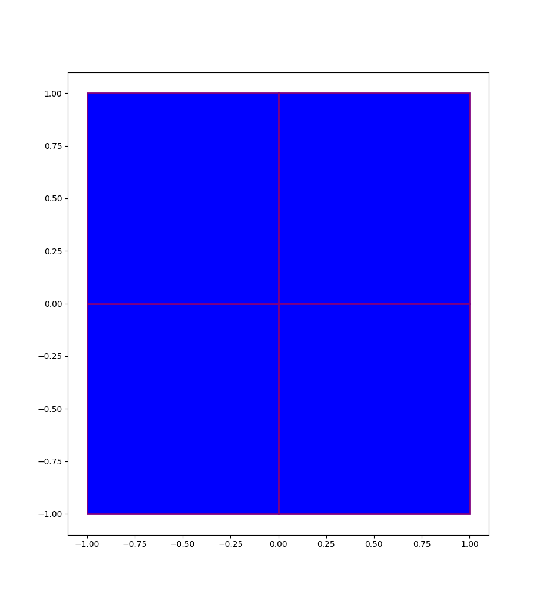

# MESH PARSER

A Simple parser for mesh files into a format usable with CSD. Currently supports the following formats:

* GMSH

The resulting format from the parser is as follows:
* points (x, y, z)
* tris (point1, point2, point3)
* quads (point1, point2, point3, point4)

Note: For the tri and quad elements, points are parsed anti-clockwise, such that the surface's normal is pointing in the +z direction.

## Installation

To intall download this repo and run the following command:

`pip install -e .`

## Example

Let's parse a rectangular mesh from GMSH with 4 quad elements. We begin by instantiating a `gmsh_parser` object with the .msh filename:

`rect = gmsh_parser('./quad.msh')`

In order to parse the file, we just need to call the `parse()` method:

`rect.parse()`

We can now access the parsed objects with `rect.get_points()`, `rect.get_tris` and `rect_get_quads`. The method `show_info()` prints some useful info about the parsed mesh:

```
-----------------------------------
Showing info about cross-section...
Number of points: 9
Number of triangles: 0
Number of quads: 4
```

With `show_2d()`, a plot of the resulitng mesh is shown:




